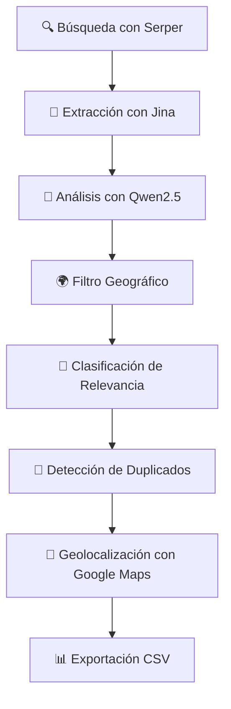

# 🕵️ Sistema de Inteligencia de Drogas - WebAgent

## 📋 Descripción General

Este sistema automatiza la búsqueda, análisis y geolocalización de incidentes relacionados con drogas en América del Sur y el Caribe. Utiliza inteligencia artificial para procesar noticias web, extraer información relevante, detectar duplicados y obtener coordenadas geográficas precisas.

### 🎯 Objetivos Principales
- **Monitoreo automático** de incidentes de drogas en la región
- **Geolocalización precisa** usando Google Maps
- **Detección inteligente de noticias duplicadas**
- **Clasificación automática de relevancia**
- **Exportación** en formato Centro Regional Base

---

## 🏗️ Arquitectura del Sistema

### 🧩 Componentes Principales

#### 1. **DrugIntelligenceAgent** (Agente Principal)
```python
class DrugIntelligenceAgent:
    - keyword_manager: Gestiona 240+ palabras clave de drogas
    - country_manager: Filtra por 57 países objetivo
    - relevance_classifier: Clasifica Alta/Media/Baja relevancia
    - duplicate_detector: Detecta noticias repetidas
```

#### 2. **DrugKeywordManager** (Gestor de Palabras Clave)
```python
7 Categorías de Drogas:
├── Estimulante y empático (MDMA, Éxtasis, Molly)
├── Opioide sintético (Fentanilo, China White, Apache)
├── Anestésico disociativo (Ketamina, Special K, Kit Kat)
├── Alucinógeno (Tusi, LSD, Tripis, Cartones)
├── Depresor (GHB, Liquid X, G)
├── Estimulante sintético (Metanfetaminas, Crystal, Ice)
└── NSP - Nuevas Drogas Sintéticas (Spice, K2, Black Mamba)
```

#### 3. **CountryManager** (Gestor Geográfico)
```python
Regiones Objetivo:
├── América del Sur (Argentina, Brasil, Chile, Colombia, etc.)
└── Caribe (Cuba, Jamaica, República Dominicana, etc.)

Filtro: México hacia abajo (excluye EE.UU. y Canadá)
```

#### 4. **RelevanceClassifier** (Clasificador de Relevancia)
```python
Criterios de Relevancia:
├── ALTA: Aparece en título + palabras clave importantes
├── MEDIA: Aparece en cuerpo del texto
└── BAJA: Solo referencias o menciones indirectas
```

#### 5. **DuplicateDetector** (Detector de Duplicados)
```python
Algoritmo de Similitud (Threshold: 70%):
├── Ubicación (40%): Misma ciudad/provincia/país
├── Fecha (30%): Diferencia máxima de 3 días
└── Contenido (30%): Similitud textual del título/descripción
```

---

## 🔧 APIs y Servicios Utilizados

### 🔑 APIs Requeridas
1. **GOOGLE_SEARCH_KEY** (Serper.dev)
   - **Función**: Motor de búsqueda en Google
   - **Uso**: Búsqueda inicial de noticias
   - **Límite**: 2,500 búsquedas gratis/mes

2. **JINA_API_KEY** (Jina AI)
   - **Función**: Extracción de contenido web
   - **Uso**: Conversión de HTML a texto limpio
   - **Límite**: 1M tokens gratis/mes

3. **DASHSCOPE_API_KEY** (Alibaba Cloud)
   - **Función**: Procesamiento con IA (Qwen2.5-72B)
   - **Uso**: Análisis y extracción de información
   - **Límite**: Según plan contratado

### 🛠️ Flujo de Procesamiento



---

## 📁 Estructura de Archivos

```
WebAgent/WebDancer/
├── 📄 drug_intelligence_agent.py      # Motor principal del sistema
├── 🚀 run_drug_intelligence.py        # Script ejecutor con interfaz
├── ⚙️ requirements_extended.txt       # Dependencias necesarias
├── 🔧 .env                           # Variables de entorno (APIs)
└── 📚 README_Sistema_Inteligencia_Drogas.md

AnalisisArchivo/
├── 📊 Centro_Regional_2025 - Base.csv  # Formato de referencia
├── 🔍 drogas palabras clave.csv        # 240+ palabras clave
├── 🌍 paises.csv                       # 57 países objetivo
└── 📈 relevancia.csv                   # Criterios de clasificación
```

---

## 🚀 Instalación y Configuración

### 1️⃣ Configurar Entorno
```bash
cd /Users/macbook/Documents/WebSearchAgent/WebAgent/WebDancer
conda create -n webdancer python=3.12
conda activate webdancer
pip install -r requirements_extended.txt
```

### 2️⃣ Configurar APIs
Editar archivo `.env`:
```bash
# API Keys para WebDancer
GOOGLE_SEARCH_KEY=tu_clave_de_serper_aqui
JINA_API_KEY=tu_clave_de_jina_aqui
DASHSCOPE_API_KEY=tu_clave_de_dashscope_aqui

# Configuración adicional
MAX_MULTIQUERY_NUM=3
```

### 3️⃣ Obtener API Keys

#### 🔍 Serper (Google Search)
1. Ve a https://serper.dev/
2. Regístrate gratis (2,500 búsquedas gratis)
3. Copia tu API key

#### 📄 Jina AI (Web Reader)
1. Ve a https://jina.ai/reader/
2. Click en "Get API Key"
3. Regístrate (1M tokens gratis/mes)
4. Copia tu API key

#### 🤖 DashScope (Qwen AI)
1. Ve a https://dashscope.console.aliyun.com/
2. Crea cuenta Alibaba Cloud
3. Ve a "API-KEY管理"
4. Crea nueva key y cópiala

---

## 🎮 Uso del Sistema

### 🚀 Ejecutar Sistema
```bash
python run_drug_intelligence.py
```

### 🎛️ Opciones Disponibles
```
🔧 OPCIONES DEL SISTEMA
1. 🔍 Escaneo rápido (últimos 3 días)
2. 📅 Escaneo semanal (últimos 7 días)  
3. 📊 Escaneo extendido (últimos 14 días)
4. ⚙️ Escaneo personalizado (1-30 días)
5. 📋 Ver configuración del sistema
6. 🚪 Salir
```

---

## 🔍 Funcionamiento Detallado

### 🌊 Flujo de Trabajo Completo

#### **Fase 1: Generación de Queries Inteligentes** 🧠
```python
# El sistema genera queries optimizadas como:
queries = [
    "fentanilo incautación últimos 7 días site:-.com OR site:-.co OR site:-.ar",
    "tusi decomiso última semana site:-.br OR site:-.pe OR site:-.cl",
    "metanfetamina captura site:-.mx OR site:-.uy OR site:-.ve"
]
```

#### **Fase 2: Búsqueda y Filtrado** 🔍
1. **Serper busca** las noticias en Google
2. **Filtro geográfico** elimina países fuera del scope
3. **Extracción de enlaces** relevantes de noticias

#### **Fase 3: Procesamiento de Contenido** 📄
1. **Jina extrae** contenido limpio de cada URL
2. **Qwen2.5 analiza** el texto para extraer:
   - Fecha del incidente
   - Ubicación granular (país > provincia > ciudad)
   - Tipo y cantidad de droga
   - Autoridades involucradas
   - Palabras clave relevantes

#### **Fase 4: Clasificación Inteligente** 🎯
```python
def classify_relevance(title, content, keywords):
    if keyword_in_title AND importante_quantity:
        return "Alta"
    elif drug_mentioned_in_body:
        return "Media"
    else:
        return "Baja"
```

#### **Fase 5: Detección de Duplicados** 🔄
```python
similarity_score = (
    location_similarity * 0.40 +    # Misma ubicación
    date_similarity * 0.30 +        # Fechas cercanas  
    content_similarity * 0.30       # Contenido similar
)

if similarity_score >= 0.70:
    mark_as_duplicate()
```

#### **Fase 6: Geolocalización** 📍
1. **Extracción jerárquica**: Ciudad → Provincia → País
2. **Búsqueda en Google Maps** con ubicación específica
3. **Extracción de coordenadas** GPS precisas
4. **Validación** de coordenadas encontradas

#### **Fase 7: Exportación Estructurada** 📊
Genera CSV con **37 campos** del formato Centro Regional Base:
```csv
Articulo_ID,CUI,Fecha_Publicacion_Articulo,Titulo_Articulo,
Descripcion_Articulo,Medio,URL_Acortada,Pais_Origen_Articulo,
Relevancia_Mencion,Keywords,Clasificacion_Sust_Estup_Decomisada,
Ubicacion_Secuestro,Geo_Pais,Geo_Prov,Geo_Distrito,
Duplicado_De,Similarity_Score,...
```

---

## 📊 Campos de Salida Detallados

### 🆔 Identificación
- **Articulo_ID / CUI**: Identificador único (A0000001, A0000002...)
- **Fecha_Publicacion_Articulo**: Formato DD/MM/YYYY
- **Medio**: Dominio de la fuente (ej. cnn.com.co)

### 📰 Contenido
- **Titulo_Articulo**: Título original de la noticia
- **Descripcion_Articulo**: Resumen extraído (max 500 chars)
- **URL_Acortada**: URL original de la noticia

### 🎯 Clasificación
- **Relevancia_Mencion**: Alta/Media/Baja
- **Keywords**: Lista de palabras clave detectadas
- **Categoria_tematica**: Siempre "Incidente"

### 💊 Información de Drogas
- **Clasificacion_Sust_Estup_Decomisada**: Categoría (ej. "Alucinógeno")
- **Tipo_Sus_Estup_Decomisada**: Sustancia específica (ej. "TUSI")
- **Cant_Sust_Estup_Sintetica_incautada**: Cantidad numérica
- **Unidad**: Tipo de medida (KG, pastillas, frascos, etc.)

### 🌍 Geolocalización
- **Pais_Origen_Articulo**: País detectado
- **Ubicacion_Secuestro**: Ciudad/Distrito específico
- **Provincia**: Estado/Provincia
- **Geo_Pais**: Coordenadas del país
- **Geo_Prov**: Coordenadas de la provincia  
- **Geo_Distrito**: Coordenadas específicas del distrito

### 🔄 Control de Duplicados
- **Duplicado_De**: CUI del incidente original (si es duplicado)
- **Similarity_Score**: Puntuación de similitud (0.00-1.00)

---

## 📈 Estadísticas y Reportes

### 📊 Métricas Automáticas
El sistema genera automáticamente:

```
📈 ESTADÍSTICAS DEL ANÁLISIS:
   📰 Total incidentes procesados: 25
   🔄 Duplicados detectados: 3
      - A0000008 (similar a A0000003, 0.85)
      - A0000015 (similar a A0000007, 0.72)
   🎯 Distribución por relevancia:
      - Alta: 12 (48.0%)
      - Media: 8 (32.0%)
      - Baja: 5 (20.0%)
   🌍 Top países con incidentes:
      - Colombia: 8
      - Argentina: 6
      - Chile: 4
   💊 Top sustancias detectadas:
      - TUSI: 7
      - Cocaína: 5
      - Metanfetaminas: 4
   📍 Con coordenadas precisas: 22 (88.0%)
```

---

## ⚡ Optimizaciones Implementadas

### 🎯 Eficiencia de Búsqueda
- **Queries dirigidas** por región y temporalidad
- **Filtrado por dominio** (site:.co, .ar, .br, etc.)
- **Límite de 15 queries** simultáneas para optimizar tokens
- **Caché de URLs** procesadas para evitar duplicación

### 🧠 Procesamiento Inteligente
- **Análisis contextual** con Qwen2.5-72B para extracción precisa
- **Patrones regex** especializados para fechas, cantidades y ubicaciones
- **Jerarquía de ubicación**: Ciudad → Provincia → País
- **Validación cruzada** de información extraída

### 🔄 Detección de Duplicados Avanzada
- **Algoritmo de similitud ponderado** (ubicación 40%, fecha 30%, contenido 30%)
- **Threshold ajustable** (por defecto 70%)
- **Comparación incremental** para eficiencia
- **Registro de similitud** para auditoría

### 📍 Geolocalización Precisa
- **Búsqueda jerárquica** en Google Maps
- **Extracción multi-patrón** de coordenadas
- **Validación de formato** GPS
- **Fallback a coordenadas** de nivel superior si falla el específico

---

## 🔧 Configuración Avanzada

### ⚙️ Parámetros Ajustables

```python
# En drug_intelligence_agent.py
class DuplicateDetector:
    def __init__(self, similarity_threshold: float = 0.7):  # Ajustar threshold
        
class DrugKeywordManager:
    def get_search_queries(self, time_limit: str = "última semana"):
        queries = []  # Modificar queries base
        return queries[:15]  # Ajustar número máximo de queries

# En .env
MAX_MULTIQUERY_NUM=3  # Queries simultáneas por batch
```

### 🎛️ Personalización de Criterios

```python
# Modificar criterios de relevancia
relevance_criteria = {
    "alta": {
        "title_indicators": ["incautación", "decomiso", "operativo"],
        "quantity_indicators": ["toneladas", "kilos", "millones"]
    }
}

# Añadir nuevas palabras clave
new_keywords = {
    "Nueva_Categoria": ["palabra1", "palabra2", "palabra3"]
}
```

---

## 🐛 Troubleshooting

### ❌ Problemas Comunes

#### 🔑 Error de API Keys
```
❌ Error: Faltan API keys:
   - GOOGLE_SEARCH_KEY
```
**Solución**: Verificar que las APIs están configuradas en `.env`

#### 📁 Archivos Faltantes
```
❌ Error: Faltan archivos de configuración:
   - drogas palabras clave.csv
```
**Solución**: Verificar que los archivos CSV están en `AnalisisArchivo/`

#### 🌐 Error de Conexión
```
❌ Error: Google search Timeout
```
**Solución**: 
- Verificar conectividad a internet
- Revisar límites de API de Serper
- Reducir número de queries simultáneas

#### 🤖 Error de Procesamiento IA
```
❌ Error al procesar incidente: API rate limit
```
**Solución**:
- Esperar y reintentar
- Verificar límites de DashScope
- Reducir `days_back` en la búsqueda

### 🔍 Logs y Debugging

```python
# Activar logs detallados
import logging
logging.basicConfig(level=logging.DEBUG)

# Ver queries generadas
print(f"Queries ejecutadas: {queries}")

# Monitorear procesamiento
print(f"Procesando: {incident.cui} - {incident.titulo[:50]}...")
```

---

## 🚀 Casos de Uso

### 📊 Monitoreo Diario
```bash
# Ejecutar cada mañana para revisar incidentes del día anterior
python run_drug_intelligence.py
# Seleccionar opción 1: Escaneo rápido (3 días)
```

### 📅 Reporte Semanal
```bash
# Para reportes semanales de inteligencia
python run_drug_intelligence.py  
# Seleccionar opción 2: Escaneo semanal (7 días)
```

### 🔍 Investigación Específica
```bash
# Para investigar tendencias en períodos específicos
python run_drug_intelligence.py
# Seleccionar opción 4: Escaneo personalizado (ej. 21 días)
```

### 📈 Análisis de Tendencias
- Ejecutar semanalmente y comparar resultados
- Identificar patrones por país/región
- Monitorear aparición de nuevas sustancias
- Detectar rutas de tráfico emergentes

---

## 🔮 Futuras Mejoras

### 🎯 Funcionalidades Planeadas
- [ ] **Dashboard web** con visualizaciones en tiempo real
- [ ] **Alertas automáticas** por Telegram/WhatsApp para incidentes de alta relevancia
- [ ] **Integración con mapas** interactivos (Leaflet/Google Maps)
- [ ] **Análisis de sentimiento** para evaluar impacto mediático
- [ ] **Predicción de tendencias** usando machine learning
- [ ] **API REST** para integración con otros sistemas

### 🛡️ Seguridad y Privacidad
- [ ] **Cifrado de APIs** keys en configuración
- [ ] **Logs auditables** para cumplimiento normativo
- [ ] **Anonimización** de datos sensibles
- [ ] **Control de acceso** basado en roles

### ⚡ Optimizaciones Performance
- [ ] **Cache Redis** para búsquedas frecuentes
- [ ] **Procesamiento paralelo** multi-thread
- [ ] **Base de datos** para almacenamiento persistente
- [ ] **Compresión de datos** para exportación masiva

---

## 📚 Referencias y Documentación

### 🔗 APIs Utilizadas
- [Serper.dev Documentation](https://serper.dev/docs)
- [Jina AI Reader API](https://jina.ai/reader/)
- [DashScope API Reference](https://help.aliyun.com/zh/model-studio/developer-reference/)

### 🛠️ Frameworks y Librerías
- [Qwen-Agent](https://github.com/QwenLM/Qwen-Agent) - Framework de agentes IA
- [Python-dotenv](https://pypi.org/project/python-dotenv/) - Gestión de variables de entorno
- [Requests](https://docs.python-requests.org/) - Cliente HTTP

### 📖 Metodología
- **ReAct Framework**: Reasoning + Acting para agentes IA
- **Information Seeking**: Búsqueda automatizada de información
- **Web Intelligence**: Extracción y análisis de datos web

---

## 👥 Créditos

### 🏗️ Arquitectura Base
- **WebAgent Framework** by Alibaba-NLP
- **WebDancer**: Autonomous Information Seeking Agency
- **Qwen2.5**: Large Language Model for analysis

### 🎯 Desarrollo Específico
- **Sistema de Inteligencia de Drogas**: Implementación personalizada
- **Detección de Duplicados**: Algoritmo propio de similitud
- **Geolocalización Automática**: Integración Google Maps
- **Exportación Centro Regional**: Formato estructurado específico

---

## 📞 Soporte

### 🐛 Reportar Issues
Para reportar problemas o sugerir mejoras:
1. Documentar el error con logs completos
2. Incluir configuración de entorno
3. Especificar pasos para reproducir
4. Proponer solución si es posible

### 📧 Contacto
- **Documentación**: Este README.md
- **Configuración**: Archivos `.env` y `requirements_extended.txt`
- **Logs**: Salida del sistema en consola

---

## 📝 Changelog

### v1.0.0 (2025-01-04)
- ✅ Implementación inicial del sistema completo
- ✅ Integración con 3 APIs (Serper, Jina, DashScope)
- ✅ Detección automática de duplicados
- ✅ Geolocalización con Google Maps
- ✅ Exportación formato Centro Regional Base
- ✅ Interfaz interactiva de consola
- ✅ Documentación completa

### Próximas Versiones
- v1.1.0: Dashboard web con visualizaciones
- v1.2.0: Sistema de alertas automáticas
- v1.3.0: API REST para integración externa

---

*📅 Última actualización: 4 de Enero, 2025*
*🔖 Versión: 1.0.0*
*👨‍💻 Estado: Producción*